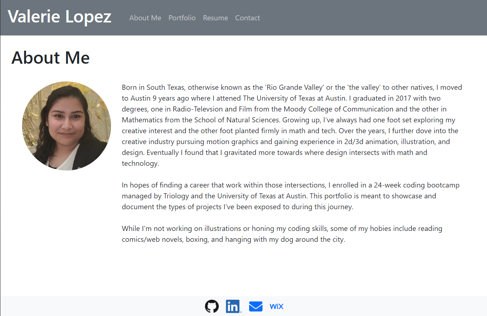
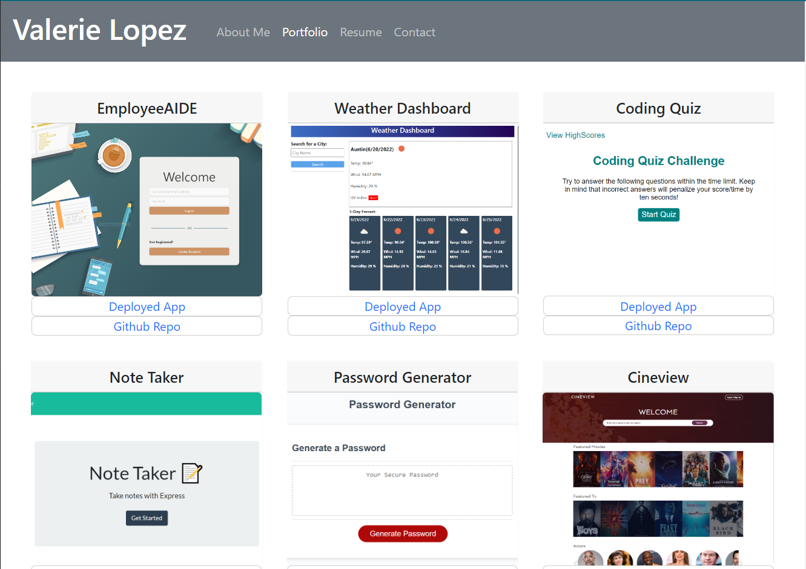
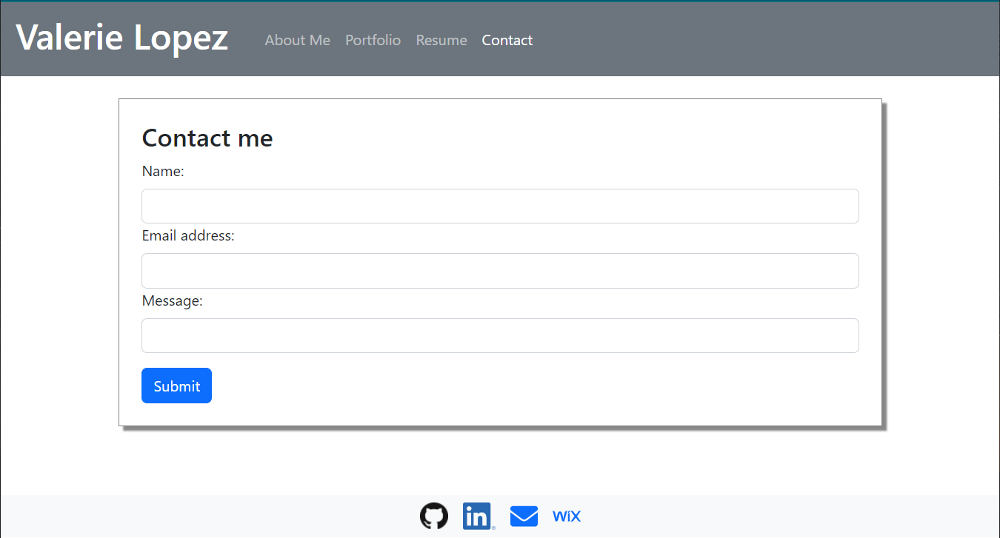

# 20-WebDev Portfolio

## Description: 
This is just a sample of create my web dev portfolio using react. There is no back end at this moment.

## Installation
Make sure to install all your dependencies, this uses react, fontawesome, and bootstrap.

## Usage

link to github project page: https://github.com/va-lopez/webdevportfolio-valerie-lopez/tree/main

